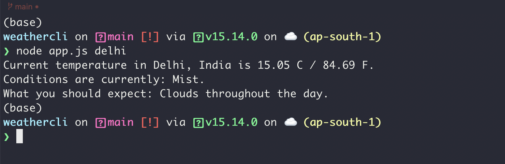

# weathercli
A Weather app made in Node.js using OpenWeatherMap and Mapbox API.

It gives the following information:
* Current temperature in both Celsius and Fahrenheit.
* Current weather condition as well as the whole day prediction based on what condition is most occuring in the next 24 hours.

## Instructions

* First clone the repository by using the following command: `git clone https://github.com/arjun-puri/weathercli.git`

* Then, open a terminal in the same git folder and type `npm install`.

* Create a .env file in the same folder and put your Openweathermap and Mapbox API keys with the following names -> `OPEN_WEATHER_API_KEY` and `MAPBOX_API_KEY`.

* Now, the application is ready to go! Run it using `node app.js "place query"`

**Note**: If the place you are querying has spaces in it then enclose it within double quotes like "New delhi".